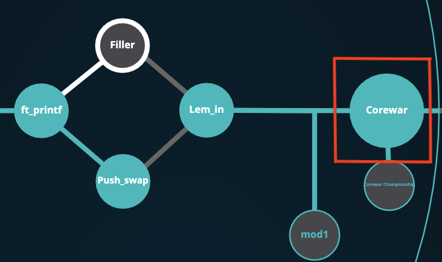
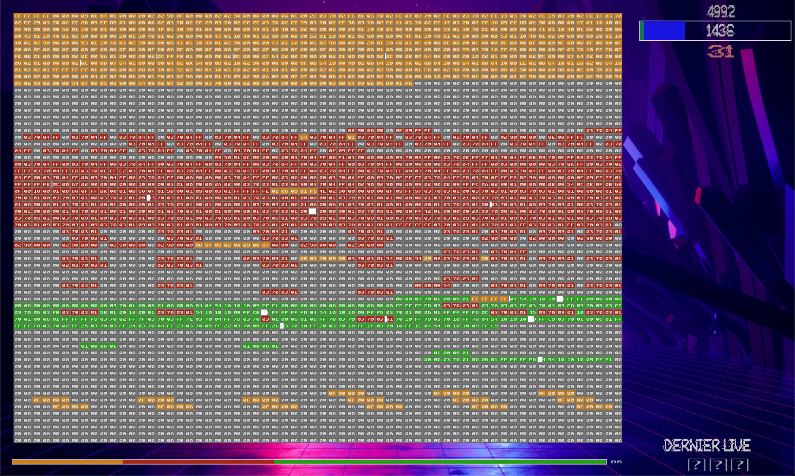
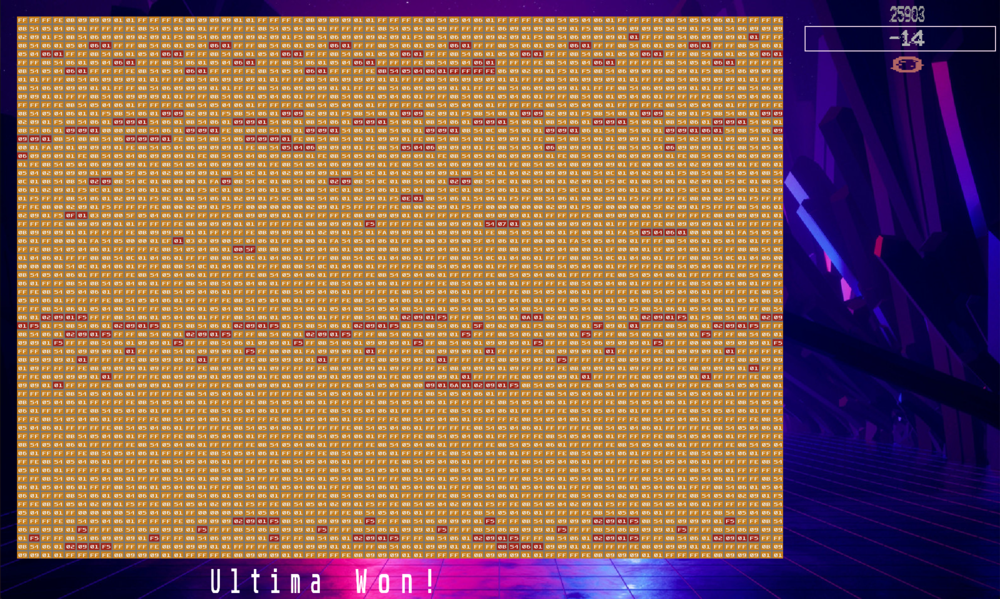
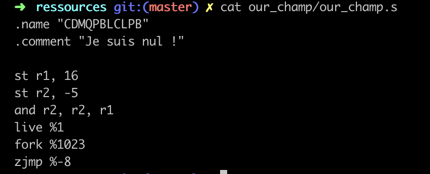

# corewar

### Final project of algorithmic branch pre-internship

This project is divided in 3 parths, the ASM compiler, the Virtual Machine and the Hero conception. We were 3 students of 42 Lyon working on this project. I focused on the Virtual Machine part.

## The ASM compiler

The purpose of this part is to compile files containing a set of custom type ASM instructions. It parses the input and turns the .s code into binary. This binary, the .cor file is a "champion". The challenge of this part, much like for the VM, is to reproduce the behavior of the ASM compiler given with the subjet (on our repo go to the directory `ressources`, the original ASM and VM are there). It's about reverse-engineering on an given binary

## The Virtual Machine

This part is also a challenge of understanding how a program was coded using only the compiled code. The VM is a simulation of a RAM segment. The memory is cyclic, so the code compiled on it is enclosed on "an arena". It needs to load the champions on the arena, execute their code until the game ends, by the death of one of the player. The processes of the champions need to instruct "live" instructions during the game to prove that the champions it fights for is still in the fight.

For the technical part, we have 16 ASM instructions to recode with the same behavior as the original VM. It is a good project to work on data with its binary form. It also creates the need of efficient debugging tools, shell scripts for us as well as a vizualiser to understand what is going on in the game. 

A game from the intro to the end

## The champion

This part was the shortest. The champion we created is basic and has for only purpose to take on the zork champion and beat it.
It is located in `ressources/our_champ` n assembler form, you will need to compile it to use its unbelievable power.

How to exec:
You will need the following dependencies installed on your shell 
- GNU Make
- GNU Compiler (gcc)
- Sdl2 (a checker les dependancies sur mon mac)

To compile the code, clone the repo, enter the repo cloned and insert make

To execute the programs either enter asm or vm directories and follow the pattern :
- Asm : `./asm <sourcefile.s>`
 
 Ex : `./asm ../ressources/barriere.s`

- VM : `./corewar [-vg] [-d nbr_cycles][-n number]champion.cor (Max: 4) `

Ex : `./corewar -g -v 31 ../ressources/cor/gateau.cor ../ressources/cor/doge.cor ../ressources/cor/casimir.cor`

where -g = visual mode , -v verbose mode that you can combine (1, 3, 7, 15, 31), -n set champion number

Those flags are not compulsory for the execution of the code but they help understand what's going on

some scripts are available in the `scripts` folder 
